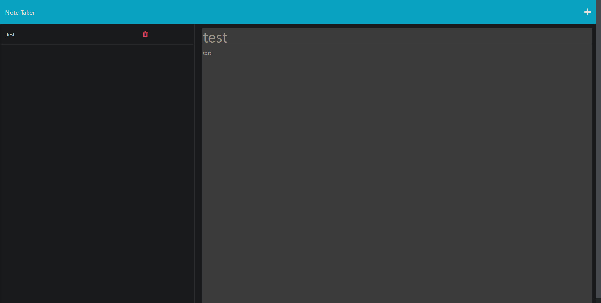

# Note Taker Application

## Description

This is a simple note-taking application built with Express.js. The application allows users to create, view, and delete notes.

## Features

- Create a new note
- View an existing note
- Delete an existing note

## Installation

1. Clone the repository to your local machine.
2. Navigate to the project directory.
3. Run `npm install` to install all dependencies.

## Usage

1. To start the server, run `node server.js` in the terminal.
2. Open your web browser and visit `http://localhost:3000`.
3. Use the application to create, view, and delete notes.

## Example

Example can be seen at the following link: https://notetaker9312.herokuapp.com/notes

## Dependencies

- [Express.js](https://expressjs.com/)
- [Node.js](https://nodejs.org/)
- [uuid](https://www.npmjs.com/package/uuid)

## Contributing

If you would like to contribute, please fork the repository and make changes as you'd like. Pull requests are warmly welcome.

## License

MIT
